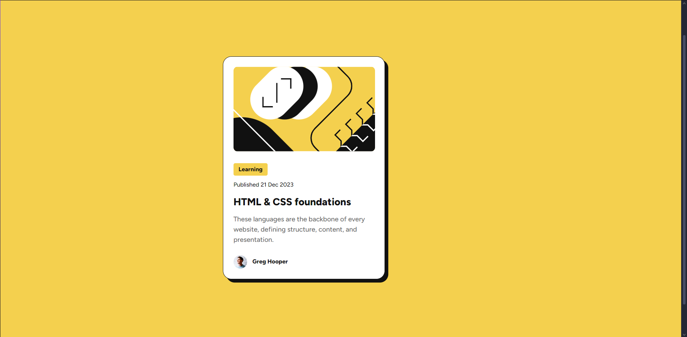

# Frontend Mentor - Blog preview card code component solution

## Table of contents

- [Overview](#overview)
  - [Screenshot](#screenshot)
  - [Links](#links)
- [My process](#my-process)
  - [Built with](#built-with)
  - [What I learned](#what-i-learned)
  - [Continued development](#continued-development)
  - [Useful resources](#useful-resources)
- [Author](#author)

## Overview

### Screenshot

### Links

- Solution URL: [Solution](https://github.com/AskArtwentythree/Blog-preview-card)
- Live Site URL: [Live Site](https://blog-preview-card-one-sooty.vercel.app)

## My process

### Built with

- Semantic HTML5 markup
- CSS custom properties

### What I learned

I imporved my knowledge about vertical alligning and how to put text in center vertically near image. Also I understand how to work shadows

### Continued development

I would like to improve my knowledge about shadows and allgining horizontally and vertically.

### Useful resources

- [wakamaifondue](https://wakamaifondue.com/beta/) - This helped me for knowing the weights of variable font
- [shadows](https://developer.mozilla.org/en-US/docs/Web/CSS/box-shadow) - This helped me to get better with shadows

## Author

- Website - [Blog preview card](https://blog-preview-card-one-sooty.vercel.app)
- Frontend Mentor - [@AskArtwentythree](https://www.frontendmentor.io/profile/AskArtwentythree)
